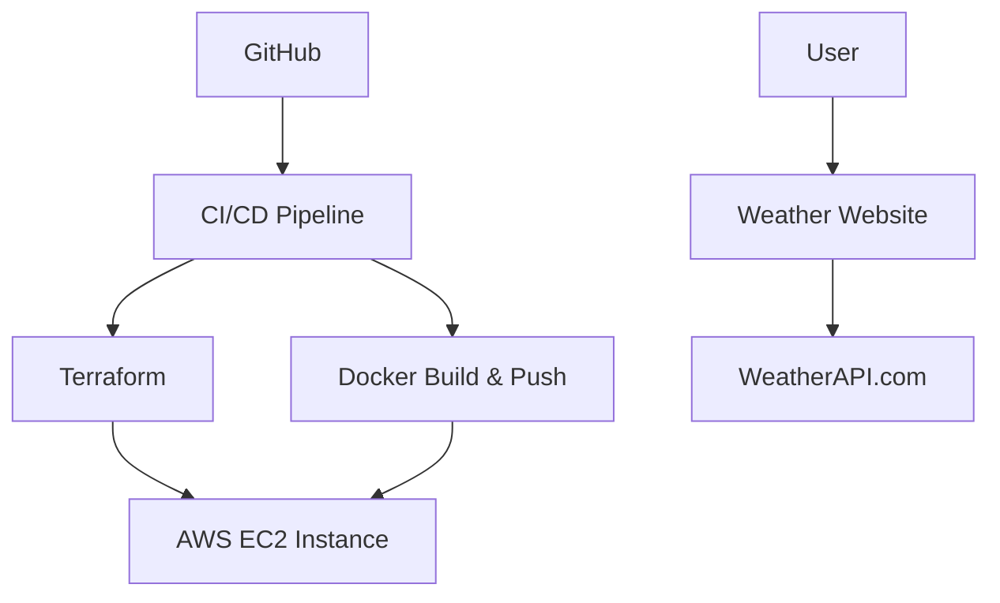

# ☁️ Dockerized Flask Weather App with CI/CD on AWS 🚀

This project is a simple Flask-based weather application that fetches real-time weather data using the [WeatherAPI](https://www.weatherapi.com/). It is containerized using Docker, deployed on an EC2 instance using Terraform, and integrated with a CI/CD pipeline using GitHub Actions for automated deployment.

---

## 🌟 Features

- 🌐 Flask web app with user input for any city
- ⛅ Real-time weather data using WeatherAPI
- 🐳 Docker container for portability
- ☁️ Deployed on AWS EC2 using Terraform
- 🔁 CI/CD pipeline using GitHub Actions

---

## 🏗️ Tech Stack

- **Frontend**: HTML (Embedded in Flask)
- **Backend**: Python Flask
- **Containerization**: Docker
- **Cloud Infra**: AWS EC2
- **Infrastructure as Code**: Terraform
- **CI/CD**: GitHub Actions

---

## 🚀 How It Works

## 🧠 Learning Outcome
- How to deploy a Docker app using Terraform on EC2

- CI/CD pipeline creation using GitHub Actions

- Automating Docker builds and deployments

- Connecting APIs in Flask

